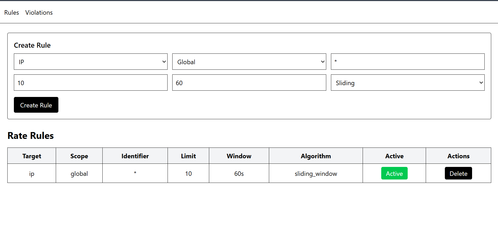

# 🚀 APIShield – Distributed Rate Limiting System

A horizontally scalable, distributed rate limiting system with dynamic rule management, multiple algorithms, real-time violation tracking, and a full-stack admin dashboard.

---

## 📌 Overview

APIShield is a distributed rate limiting engine designed to work across multiple backend instances while maintaining consistent request enforcement using Redis.

The system supports:

* Fixed Window
* Sliding Window (Lua-based atomic execution)
* Token Bucket

Rules are dynamically configurable via MongoDB and managed through an admin dashboard.

---

## 🏗 Architecture

```
Client
   │
   ▼
Backend Instance 1  ─┐
Backend Instance 2  ─┼──> Redis (Centralized Enforcement)
                     │
                     └──> MongoDB (Rule Storage)
```

* Multiple backend instances scale horizontally.
* Redis ensures atomic and consistent rate enforcement.
* MongoDB stores dynamic rate rules.
* Admin dashboard manages rules and monitors violations.

---

## 🧠 Key Features

### ✅ Distributed Enforcement

* Multiple backend containers
* Shared Redis instance
* Consistent rate limiting across instances

### ✅ Multiple Algorithms

* Fixed Window
* Sliding Window (Atomic Lua Script)
* Token Bucket

### ✅ Dynamic Rule Engine

Rules stored in MongoDB with:

* target: `ip` or `user`
* scope: `global` or `endpoint`
* algorithm selection
* activation toggle

### ✅ Rule Priority Resolution

1. Endpoint + User
2. Endpoint + IP
3. Global + User
4. Global + IP
5. Fallback Rule

### ✅ Default Fallback Protection

If no rule matches, system applies a safe default limit to prevent unlimited access.

### ✅ Violation Tracking

Redis counters track:

* Per-IP violations
* Per-user violations

### ✅ Admin Dashboard

* Create / Update / Delete rules
* Toggle active state
* View violation analytics

---

## ⚙️ Tech Stack

### Backend

* Node.js
* Express.js
* Redis (ioredis)
* MongoDB (Mongoose)
* Lua scripting
* Docker

### Frontend (Admin Dashboard)

* React
* TypeScript
* Axios
* Tailwind CSS
* Vite

---

## 🐳 Dockerized Infrastructure

The entire system runs using:

```bash
docker-compose up --build
```

Services:

* redis
* mongo
* backend1
* backend2
* dashboard

---

## 🔁 Distributed Validation

To validate horizontal scaling:

1. Run both backend containers.
2. Apply a global rate rule (e.g., limit 5 requests).
3. Send alternating requests to:

   * localhost:3000
   * localhost:3001
4. 6th request gets blocked.

This proves:

* Both instances share centralized Redis enforcement.
* Counters remain consistent across instances.

---

## 📊 Algorithms Comparison

### Fixed Window

* Simple counter reset every window.
* Low memory usage.
* Boundary burst issue.

### Sliding Window (Lua-based)

* Uses Redis Sorted Sets.
* Removes outdated entries.
* Fully atomic via Lua script.
* Accurate enforcement.

This sliding approcach makes 4 round of request which create latency when the number of requests increase to avoid that we can go with lua scripting which is Accurate, Efficient, Atomic and Production-grade

```js
//basic sliding window
import redis from "../config/redis.js";

const rateLimiter = async (req, res, next) => {
  try {
    const ip = req.ip;

    const limit = 5;
    const window = 60; // seconds

    const key = `rate:ip:${ip}`;
    const now = Date.now();
    const windowStart = now - window * 1000;

    // Remove old requests
    await redis.zremrangebyscore(key, 0, windowStart);

    // Add current request
    await redis.zadd(key, now, now);

    // Count current requests in window
    const requestCount = await redis.zcard(key);

    // Set expiration so key doesn't stay forever
    await redis.expire(key, window);

    if (requestCount > limit) {
      return res.status(429).json({
        message: "Too many requests. Try again later.",
      });
    }

    next();
  } catch (error) {
    console.error("Sliding window error:", error);
    next();
  }
};

export default rateLimiter;
```
### Token Bucket

* Smooth rate limiting.
* Allows burst up to bucket capacity.
* Refills tokens over time.

---

## 🔒 Failure Handling Strategy

* Mongo failure → fallback rule applies.
* Missing rule → default system protection.
* Redis failure → system can be configured to fail-open or fail-safe.
* TTL caching reduces Mongo query load.

---

## 📸 Dashboard Screenshot



* Rules Management
* Violations Analytics

---

## 📂 Project Structure

```
APIShield/
 ├── backend/
 |    ├── app.js
 |    ├── server.js
 |    ├── src/
 |        ├── cache/
 │        ├── config/
 │        ├── controllers/
 │        ├── middleware/
 │        ├── models/
 │        ├── routes/
 |        ├── services/
 │        └── strategies/
 │
 ├── admin/
 │
 ├── docker-compose.yml
 └── README.md
```

---

## 🎯 What This Project Demonstrates

* Distributed systems understanding
* Atomic operations in Redis
* Strategy design pattern
* Horizontal scaling validation
* Middleware-based architecture
* Docker multi-container orchestration
* Full-stack integration


